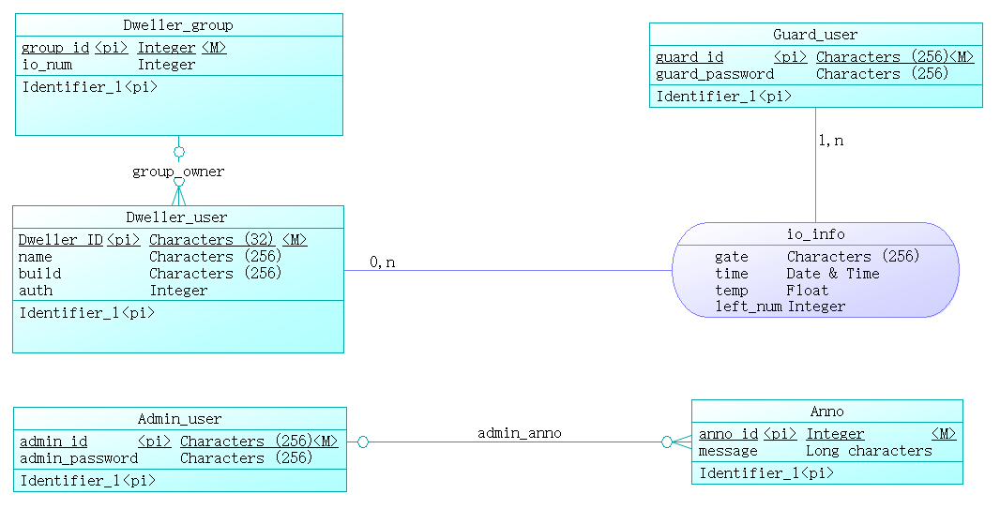
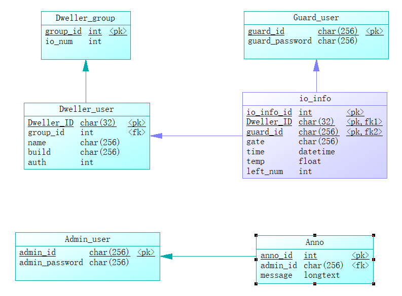

# db-table

## 住户用户表

- 身份证号 pk
- 姓名
- 楼栋
- 出入权限
- 住户组号 fk

## 住户组

- 住户组号 自增主键 unsigned-int pk
- 出入次数上限 

## 门卫用户表

- 用户名 pk
- 密码

## 管理员用户表

- 管理员用户名 pk
- 管理员密码

## 出入信息表

- 自增主键 unsigned-int pk
- 出入住户ID fk
- 通过门卫ID fk
- 出入大门编号
- 时间
- 体温
- 剩余出入次数

## 公告表

- 公告ID 自增主键 unsigned-int pk
- 发布管理员ID fk
- 公告内容

# Powerdesigner

## Conceptual Diagram

## Physical Diagram

